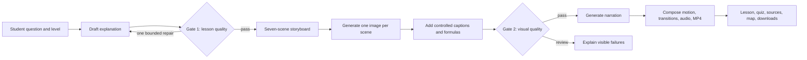

# Explain It! Contributor Career, Portfolio, and Interview Guide

**For collaborators, contributors, presenters, and future maintainers**
**Guide version:** 1.0, August 2026

> This guide helps contributors describe Explain It! accurately and confidently. Replace every bracketed placeholder with evidence from your own work. Use **we** for team decisions and shared outcomes; use **I** only for work you personally performed and can explain in detail.

## 1. Quick-start checklist

Before using this project in a résumé, application, interview, or presentation:

- Read the project overview and technical facts in this guide.
- Record three things you personally did, with links to commits, pull requests, designs, tests, figures, or notes.
- Choose a description matched to your audience: software, AI/ML, education, product, or research.
- Prepare one 60-second explanation and two honest technical stories.
- Be able to explain both quality gates, why direct text-to-video was removed, and what the system cannot guarantee.
- Use the official DOI when citing the deposited white paper.
- Never claim measured learning gains, peer review, guaranteed correctness, or ownership of another contributor's work.

## 2. Canonical project identity

**Name:** Explain It!
**Product message:** *Ask anything. See it clearly.*

### One-sentence description

Explain It! is a Streamlit learning application that turns a high-school student's question into a checked explanation, a seven-scene visual lesson, narration, an inspectable 1080p video, practice questions, sources, and related-topic exploration.

### Official release record

The white paper was deposited on Zenodo as open-access software documentation:

- **Title:** *Explain It!: Why We Generate, Check, and Compose High-School Lessons in Stages*
- **Creators recorded by Zenodo:** Meiyu Shen, Yifan Yan, and Jiachen Yu
- **Publication date:** August 6, 2026
- **Resource type:** Software documentation
- **License:** Creative Commons Attribution 4.0 International (CC BY 4.0)
- **DOI:** [10.5281/zenodo.21816608](https://doi.org/10.5281/zenodo.21816608)
- **Record:** [zenodo.org/records/21816608](https://zenodo.org/records/21816608)
- **Application:** [teachhighschool.streamlit.app](https://teachhighschool.streamlit.app/)
- **Repository:** [github.com/allanzhang721/AiLessonStudio](https://github.com/allanzhang721/AiLessonStudio)

### Recommended citation

Use the metadata shown on the Zenodo record unless a newer record version changes it:

> Shen, M., Yan, Y., & Yu, J. (2026). *Explain It!: Why We Generate, Check, and Compose High-School Lessons in Stages*. Zenodo. https://doi.org/10.5281/zenodo.21816608

For a CV:

> Shen, M., Yan, Y., & Yu, J. (2026). *Explain It!: Why We Generate, Check, and Compose High-School Lessons in Stages* [Software documentation]. Zenodo. https://doi.org/10.5281/zenodo.21816608

For a slide footer:

> Shen, Yan, and Yu (2026), *Explain It!*, doi:10.5281/zenodo.21816608

```bibtex
@misc{shen2026explainit,
  author       = {Meiyu Shen and Yifan Yan and Jiachen Yu},
  title        = {Explain It!: Why We Generate, Check, and Compose
                  High-School Lessons in Stages},
  year         = {2026},
  publisher    = {Zenodo},
  doi          = {10.5281/zenodo.21816608},
  url          = {https://doi.org/10.5281/zenodo.21816608},
  note         = {Software documentation}
}
```

### Describe the publication status accurately

Good wording:

- “We released the project white paper as open-access software documentation on Zenodo.”
- “The project has a citable Zenodo record and DOI.”
- “I co-authored the Explain It! project white paper.”
- “The documentation is publicly archived under CC BY 4.0.”

Avoid:

- “Published in Zenodo.” Zenodo is a repository, not a peer-reviewed journal.
- “Peer-reviewed paper,” unless it is later accepted through a documented review process.
- “Research-proven learning system.” No student learning gain has been established.
- “Academic publication” without qualification. “Archived project white paper” is clearer.

### Important publication-consistency check

At the time this guide was prepared, the repository paper and deposited record may not be identical:

- Zenodo lists creators as **Meiyu Shen, Yifan Yan, Jiachen Yu**.
- The current repository paper displays **Yifan Yan, Meiyu Shen, Jiachen Yu** and states that all authors contributed equally.
- The paper received figure, formatting, authorship, and text corrections after the deposited PDF.

Equal contribution does not automatically resolve inconsistent author ordering. The team should agree on one canonical order and use it consistently in the PDF, Zenodo metadata, slides, websites, applications, and citations. Zenodo permits metadata edits; changed files normally require a new version. Follow the official [record editing guidance](https://help.zenodo.org/docs/deposit/manage-records/) and [versioning guidance](https://help.zenodo.org/docs/deposit/manage-versions/).

Before widely promoting the DOI:

1. Compare the deposited PDF with the current release PDF.
2. Confirm title, author order, equal-contribution statement, version, and date.
3. Correct metadata-only differences where appropriate.
4. If the PDF changed materially, create a new Zenodo version.
5. Add a useful description, keywords, version, repository relation, and app relation.
6. Obtain approval from all authors for the canonical record.

## 3. What problem does Explain It! address?

A fluent language-model answer is not automatically factual, grade-appropriate, visually coherent, well sourced, or easy to practise. Turning a weak answer directly into media can multiply its problems and waste money.

Explain It! treats lesson generation as a staged engineering problem. It creates an explanation first, checks it before expensive media generation, builds a structured visual sequence, checks rendered frames, and only then releases the final download.

The central idea is:

> Generate small, inspectable artifacts; check them where failure is cheapest to repair; then compose approved pieces into the final lesson.

## 4. End-to-end architecture



### Workflow

1. **Connect models.** A visitor supplies one primary provider key. If that provider lacks image generation, the interface offers an optional image-provider key.
2. **Define the lesson.** The student enters a topic and selects level or lesson preferences.
3. **Draft the explanation.** A text model produces a structured high-school explanation.
4. **Run Gate 1.** Fast local checks and a compact audit evaluate the explanation. At most one repair is permitted.
5. **Build the lesson package.** The approved explanation is organized into key ideas, reasoning, mistakes, sources, practice, and related topics.
6. **Plan seven scenes.** Every scene receives a purpose, narration, visual prompt, caption, and continuity role.
7. **Generate visuals.** The system creates or edits one image for each scene instead of requesting direct text-to-video.
8. **Render overlays.** Captions and formulas are placed in code for consistency and readability.
9. **Run Gate 2.** Render-health metrics inspect every frame in parallel; a contact-sheet review checks semantic alignment and sequence quality.
10. **Compose media.** Speech, restrained motion, transitions, and audio-aware timing become a standard MP4.
11. **Support active study.** Learners use practice questions, sources, a concept neighborhood, and full or visual-only regeneration.

## 5. Technical components and decisions

### Provider and API-key design

The repository documents configurable OpenAI and DeepSeek text options, plus OpenAI and Alibaba Model Studio image paths. Model names and availability can change, so say “provider-configurable” unless exact live options were verified immediately before a demo.

The interface aims to:

- ask for the primary API key once;
- reuse that provider where it supports the task;
- and request a second key only when a separate image service is needed.

Visitor keys are designed to remain in the active Streamlit session and not be intentionally written to project files, logs, or environment variables. Authorized requests still reach external providers and remain subject to their privacy, retention, safety, availability, and billing policies. Say “designed not to persist keys,” not “perfectly secure.”

### Gate 1: check before media cost

Gate 1 combines fast structural checks with a five-dimension model review:

1. accuracy;
2. completeness;
3. logical flow;
4. grade-level fit;
5. clarity.

If improvement is needed, the system permits one repair. An unlimited self-revision loop can raise cost and inconsistency without guaranteeing convergence. A single repair provides a second chance while keeping behavior predictable.

### Gate 2: inspect rendered frames

Gate 2 evaluates the output images, not merely their prompts. Its five local render-health dimensions are:

1. resolution;
2. exposure;
3. contrast;
4. detail;
5. caption-band readability.

Checks run across frames in parallel. A compact contact-sheet review then examines topic alignment, sequence continuity, and obvious instructional mismatches. Every required frame must pass before the normal download path is released.

Gate 2 is deliberately modest: a sharp, readable image can still be scientifically wrong. Pixel statistics are failure detectors, not proofs of truth.

### Video composition

The current product has no direct text-to-video path. That route was removed because it was costly and difficult to inspect, repair, and reproduce scene by scene.

The maintained workflow:

- creates seven planned images;
- fits them into 1920 × 1080 frames with a blurred 16:9 background;
- adds deterministic captions and formulas;
- applies restrained Ken Burns motion;
- uses half-second crossfades;
- adjusts scene duration around narration;
- creates WAV narration and normalizes listening level;
- and exports H.264 video with AAC audio in a browser-compatible MP4.

The implementation targets 30 fps, H.264 CRF 18, AAC at 192 kb/s, `yuv420p`, and fast-start metadata. These are engineering targets, not guarantees across all external environments.

### Sources and grounding

The OpenAI path can optionally use Responses API web search to support cited research. The DeepSeek text path does not provide the same grounded search behavior in this project.

Contributors must distinguish among:

- generating a plausible explanation;
- summarizing retrieved sources;
- displaying a citation link;
- and verifying that a source supports a particular claim.

These are not equivalent. Citations improve traceability but do not remove human review.

### Concept neighborhood

The interactive graph connects the topic to prerequisites, applications, contrasting ideas, and next topics. Learners can select nodes, open study panels, inspect sources, try challenges, and record progress. Its purpose is navigation, not a decorative graph.

### Regeneration

After generation, users can regenerate the full lesson or preserve the approved explanation and regenerate only images, narration, and video. Visual-only regeneration avoids changing good text when the visual style is the only problem.

### Testing and deployment

The production suite currently contains 33 tests covering gates, schemas, providers, Streamlit rendering, narration, timing, and H.264 output. The application targets Python 3.12 and Streamlit Community Cloud. Technologies include Python, Streamlit, model APIs, Pillow, Requests, ImageIO, ImageIO-FFmpeg, Graphviz, LaTeX/BibTeX, and Matplotlib.

## 6. Mathematical and engineering intuition

### Check cheap work before expensive work

Let text drafting cost \(C_t\), each image cost \(C_i\), narration cost \(C_a\), and composition cost \(C_v\). Seven-scene media costs approximately:

\[
C_{media}=7C_i+C_a+C_v.
\]

If a weak explanation is found only after media generation, nearly all of \(C_{media}\) may be wasted. Early checking is sensible whenever:

\[
C_t < 7C_i+C_a+C_v.
\]

This is a design rationale, not proof that every request saves money.

### Bound self-revision

If a repair costs \(r\), allowing one repair bounds repair cost by \(r\). An unbounded loop has unpredictable cost and latency and is not guaranteed to converge.

### Match checks to failure types

A lesson can fail structurally, instructionally, visually, semantically, or operationally. No single score captures all five. Explain It! uses small checks near the artifact they understand best.

### Compose inspectable assets

Separate images, captions, narration, and transitions let a contributor inspect and replace one failed scene. Direct video may offer richer motion, but it reduces scene-level control and can cost more to retry.

## 7. Why the project is more than “an LLM wrapper”

The strongest story is not “we called an API.” It is that the team designed a user-facing system around uncertain outputs:

- multi-provider capability handling;
- visitor credential UX;
- structured prompting and schema validation;
- bounded generate-review-repair logic;
- local and model-assisted quality checks;
- parallel frame inspection;
- deterministic typography over generated imagery;
- narration-aware video timing;
- browser-compatible encoding;
- source-aware lesson panels;
- interactive knowledge navigation;
- selective regeneration;
- cloud deployment constraints;
- and honest limitation reporting.

## 8. Contribution evidence

### Equal contribution is not identical contribution

The paper says all authors contributed equally. This concerns overall importance or amount, not identical tasks. Each contributor still needs a precise personal record.

Ask:

- What problem did I own?
- What did I create or change?
- Which decision did I influence?
- What evidence shows the result?
- What did I learn?
- What would I improve now?

### Personal contribution matrix

| Area | My specific contribution | Evidence | Outcome | What I can explain deeply |
|---|---|---|---|---|
| Product definition | [Work] | [Issue/notes] | [Result] | [Trade-off] |
| Streamlit UI | [Work] | [PR/screenshots] | [Result] | [State/CSS] |
| Text providers | [Work] | [Code/tests] | [Result] | [API/schema] |
| Image providers | [Work] | [Code/tests] | [Result] | [Fallback/cost] |
| Gate 1 | [Work] | [Code/test/paper] | [Result] | [Metrics/bound] |
| Gate 2 | [Work] | [Code/test/paper] | [Result] | [Metrics/review] |
| Video pipeline | [Work] | [Code/video] | [Result] | [Timing/codec] |
| Sources | [Work] | [Code/sample] | [Result] | [Grounding] |
| Concept graph | [Work] | [Code/demo] | [Result] | [Interaction] |
| Testing | [Work] | [Test/CI] | [Result] | [Failure case] |
| White paper | [Work] | [Section/figure] | [Result] | [Claim boundary] |
| Deployment | [Work] | [Config/release] | [Result] | [Constraint] |
| Coordination | [Work] | [Decision log] | [Result] | [Resolution] |

### Contribution log template

```text
Date:
Problem:
My role:
Decision made:
Implementation or artifact:
How it was tested:
Result:
Evidence link:
Collaborators:
What I learned:
What remains uncertain:
```

### CRediT-style vocabulary

Use only roles supported by evidence: Conceptualization, Methodology, Software, Validation, Formal analysis, Investigation, Data curation, Writing—original draft, Writing—review and editing, Visualization, Project administration, and Resources.

Do not assign the same list to every author automatically. Discuss and approve it as a team.

### “We” and “I” rule

Say:

> “We designed a two-stage quality workflow. I focused on [component], where I [action].”

Avoid:

> “I built the entire platform,” if the work was collaborative.

A useful interview rhythm is:

1. **We:** shared problem and team decision.
2. **I:** your ownership and actions.
3. **We:** integrated result and learning.

## 9. Skills used and learned

### Software engineering

- Python application architecture
- Streamlit state and reactive interfaces
- modular provider adapters
- structured outputs and schema validation
- exception handling and user-facing errors
- concurrency for independent checks
- temporary-artifact management
- dependency and environment management
- Git, branches, commits, reviews, and releases
- regression testing and deployment verification

Prepare: one function walkthrough, one diagnosed bug, one test, and one design choice you would reconsider.

### AI and API engineering

- educational prompt design
- text and image provider integration
- model configuration
- retrieval-aware generation
- model-based evaluation and its limitations
- timeouts, retries, and malformed-output handling
- token, image, speech, latency, and cost awareness
- deterministic versus probabilistic validation
- session-based credential handling

Prepare: an example schema, a failure case, and why model output still needs validation.

### Multimodal media

- storyboard decomposition and continuity
- image prompt construction
- image fitting and blurred backgrounds
- typography and formula rendering
- narration generation and normalization
- scene timing and transition design
- H.264/AAC composition
- rendered-media quality checks

Prepare: one seven-scene example and one problematic frame with its correction.

### Evaluation and reasoning

- multi-metric evaluation
- threshold design
- false positives and false negatives
- proxy metrics versus desired outcomes
- expected-cost reasoning
- bounded iteration
- offline benchmarks versus production behavior
- ROC/AUC concepts when discussing paper experiments
- dataset mismatch and threats to validity

Prepare: explain one metric in plain language and what it cannot measure.

### Product and UX

- simplified API-key configuration
- progressive disclosure
- useful waiting messages
- visual accessibility and contrast
- selective regeneration
- friendly gate results
- interactive concept exploration
- explicit failure states

Prepare: a before/after screenshot and the user problem that motivated it.

### Research communication

- project white-paper writing
- diagrams and figures
- notation and authorship consistency
- evidence-aware abstracts
- bibliography management
- high-school-level mathematical explanations
- DOI deposit and metadata hygiene
- distinguishing evidence, inference, and aspiration

### Collaboration

- dividing ambiguous work
- reviewing teammates' changes
- documenting decisions
- resolving attribution questions
- responding to interface feedback
- prioritizing high-impact fixes
- presenting to non-specialists

## 10. Turn skills into evidence

| Weak claim | Stronger statement |
|---|---|
| “Know Python” | “Built and tested a Python/Streamlit pipeline coordinating text, image, speech, and video stages.” |
| “Know AI” | “Integrated configurable model providers with schema checks, bounded repair, and visible failure handling.” |
| “Good teamwork” | “Coordinated [integration/review] across three equal contributors and documented [decision].” |
| “Improved quality” | “Added pre-media explanation checks and per-frame render checks before download.” |
| “Published research” | “Co-authored an open-access project white paper archived on Zenodo with a DOI.” |

## 11. Résumé and CV guide

### Where it belongs

Use **Projects** for software applications, **Research Experience** for evaluation work, **Publications and Technical Writing** for the Zenodo record, or **Selected Software** on a longer CV. It may appear in Projects and Publications if the entries are not repetitive.

### General project entry

```text
Explain It! — Contributor / [Accurate role]                              2026
Python, Streamlit, LLM APIs, Pillow, ImageIO-FFmpeg, Graphviz
• Co-developed a staged learning application that converts high-school questions
  into checked explanations, seven-scene visual lessons, narration, practice, and
  browser-compatible 1080p videos.
• [Your personal action], resulting in [verified outcome or artifact].
• Contributed to quality gates that inspect lesson structure and rendered visual
  health before download while documenting that automated checks are not guarantees.
• Co-authored software documentation archived on Zenodo with DOI
  10.5281/zenodo.21816608.
```

### Compact one-page résumé

```text
Explain It! | Python, Streamlit, multimodal APIs, FFmpeg                  2026
• Built [your component] for a staged AI lesson generator producing checked
  explanations and seven-scene narrated videos for high-school topics.
• Implemented [gate/provider/video/UI/test contribution], validated by [evidence];
  co-authored a citable Zenodo project white paper.
```

### Software engineering version

```text
• Engineered [module] in a Python/Streamlit application coordinating text, image,
  speech, and H.264/AAC video stages through structured interfaces.
• Added [validation, retry, or state behavior] and [specific tests], improving
  [observable reliability outcome without inventing a percentage].
• Implemented selective media regeneration so users can preserve approved lesson
  text while replacing images, narration, and video.
```

### AI/ML version

```text
• Integrated configurable text and image providers with validated structured output,
  capability fallbacks, and user-supplied session credentials.
• Developed a bounded generate-check-repair workflow using deterministic structural
  checks and a five-dimension model audit before costly media generation.
• Distinguished offline classifier experiments from deployed heuristics and model
  reviews, preventing unsupported claims about the production gates.
```

### Product/UX version

```text
• Redesigned model connection around one primary API-key entry and an optional image
  key only when the selected provider lacks image generation.
• Created [your interface work] for sources, misconception guidance, regeneration,
  and interactive related-topic exploration.
• Translated quality results into friendly, actionable feedback and useful study tips
  during long-running generation.
```

### Education version

```text
• Co-designed a lesson format combining explanation, worked reasoning, common
  mistakes, reliable sources, practice questions, and related concepts.
• Structured cumulative visual scenes so narration and imagery develop one concept
  rather than presenting unrelated illustrations.
• Documented educational hypotheses and proposed classroom evaluation rather than
  claiming unmeasured learning improvements.
```

### Research-writing version

```text
• Co-authored a 24-page project white paper explaining architecture, staged quality
  gates, cost reasoning, evaluation limits, and future study design.
• Produced or revised [figure/appendix/section] using LaTeX, BibTeX, and Matplotlib.
• Separated production heuristics from offline experiments and documented threats to
  validity, including proxy metrics and provider dependence.
```

### Publication section

```text
PUBLICATIONS AND SOFTWARE DOCUMENTATION
Shen, M., Yan, Y., & Yu, J. (2026). Explain It!: Why We Generate, Check,
and Compose High-School Lessons in Stages. Zenodo.
https://doi.org/10.5281/zenodo.21816608
Role: Equal contributor; [brief personal contribution if space permits].
```

Use the canonical author order selected by the team. Do not reorder a formal citation to place yourself first.

### High-school or university application

```text
Explain It! — Co-creator and Equal Contributor
• Helped turn an open-ended idea—making AI explanations easier to inspect—into a
  deployed application and citable project white paper.
• Personally led [work], learning [skill] and resolving [obstacle] through [action].
• Explained technical decisions and limitations for high-school audiences, including
  why quality scores provide evidence rather than proof.
```

### Bullet formula

> **Action verb + personal component + technical method + verified evidence + why it mattered.**

Example:

> Implemented **[component]** using **[method]**, verified through **[tests/demo]**, so **[user or engineering benefit]**.

Never invent a percentage. Useful verbs include architected, implemented, integrated, validated, tested, refactored, deployed, documented, analyzed, visualized, composed, coordinated, investigated, debugged, simplified, reviewed, and presented.

Avoid “revolutionized,” “mastered,” or “guaranteed.”

### ATS keywords

Use only those matching your real contribution:

`Python`, `Streamlit`, `REST APIs`, `LLM`, `multimodal AI`, `OpenAI API`, `DeepSeek`, `image generation`, `text-to-speech`, `Pillow`, `ImageIO`, `FFmpeg`, `H.264`, `AAC`, `Graphviz`, `structured outputs`, `schema validation`, `prompt engineering`, `quality assurance`, `automated testing`, `Git`, `GitHub`, `LaTeX`, `BibTeX`, `Matplotlib`, `deployment`, `technical writing`, `human-centered AI`, `educational technology`.

## 12. LinkedIn, portfolio, and cover letter

### LinkedIn description

> Explain It! is a staged AI lesson studio for high-school learners. Our team built a Python/Streamlit workflow that checks an explanation before generating seven visual scenes, narration, a 1080p MP4, practice, sources, and an interactive concept neighborhood. I contributed [specific work]. We released a white paper as open-access software documentation on Zenodo: https://doi.org/10.5281/zenodo.21816608. The system is an engineering prototype; its checks reduce visible failure risk but do not guarantee correctness or learning gains.

### Portfolio case study

1. Hero: one sentence, screenshot, role, date, and links.
2. Problem: why one-shot generated lessons are difficult to trust.
3. Users: high-school students and educators.
4. Constraints: API cost, latency, variability, readability, and video compatibility.
5. Personal contribution with evidence.
6. Architecture and two gates.
7. Key decision: composition rather than direct text-to-video.
8. Evidence: tests, screenshots, lesson, white paper, DOI.
9. Limitations.
10. Reflection and next evaluation.

### Cover-letter paragraph

> In Explain It!, a three-person educational technology project, we learned that integrating a language model is only the beginning of building a useful product. We designed the workflow so a low-cost explanation check happens before image and video work, then inspected rendered frames before enabling download. I personally [contribution], where I learned [lesson]. The project strengthened my skills in [skills] and taught me to describe automated evaluation honestly: our checks identify important failure signals, but they do not prove correctness or learning. We documented the system in an open-access Zenodo white paper with a persistent DOI.

## 13. Interview introduction scripts

### 15 seconds

> Explain It! turns a high-school question into a checked explanation and seven-scene narrated visual lesson. We check text before expensive media and inspect rendered frames before composing a 1080p video.

### 45 seconds

> Explain It! is a Streamlit application for high-school learners. A student enters a topic and connects a model provider. The app drafts an explanation, checks five instructional dimensions, and allows one repair before spending money on media. It plans seven cumulative scenes, generates images, adds controlled captions, checks every frame, creates narration, and composes an MP4. It also includes sources, practice, likely mistakes, regeneration, and a concept neighborhood. I focused on [your work].

### 90 seconds

> Our starting question was how to make generated educational content more inspectable without pretending an automated score guarantees truth. First, a text model creates a high-school explanation. Gate 1 combines structural validation with a five-dimension review and permits one repair because media is more expensive. The app then creates a seven-scene storyboard and inspectable images instead of direct text-to-video. It adds captions deterministically, and Gate 2 checks render health on every frame plus the sequence through a contact sheet. It produces narration and a 1080p H.264/AAC video, alongside practice, sources, misconception guidance, and related-topic exploration. My contribution was [work and evidence]. The project is deployed and documented on Zenodo, but we do not claim measured learning gains or guaranteed correctness.

## 14. Interview questions and sample answers

Use these as frameworks, not memorized claims.

### 1. What is Explain It!?

It is a staged lesson-generation application for high-school students. It creates a checked explanation, seven visual scenes, narration, composed video, sources, practice, and concept exploration. Its main idea is to inspect smaller artifacts before expensive downstream work.

### 2. What problem were you solving?

A one-shot answer can be fluent but unclear, too advanced, unsupported, or visually inconsistent. Students also need reasoning, mistakes, practice, and connections. We built a guided lesson package and made quality status visible.

### 3. Why two gates?

They inspect different artifacts. Gate 1 evaluates text when repair is cheap. Gate 2 evaluates actual frames because prompts cannot reveal blank, unreadable, or inconsistent renders. One gate cannot cover both failure types well.

### 4. How does Gate 1 work?

It combines structural checks with a compact review of accuracy, completeness, logical flow, grade fit, and clarity. It allows one repair to provide a second chance while bounding latency and cost.

### 5. How does Gate 2 work?

It checks resolution, exposure, contrast, detail, and caption readability on every frame, then reviews a contact sheet for alignment and continuity. These checks detect warning signs; they do not prove scientific correctness.

### 6. Are the production gates trained classifiers?

No. The deployed gates use local heuristics plus compact model review. The paper reports offline classifier experiments, but those benchmark models are not the production implementation.

### 7. Why remove direct video generation?

It was costly and hard to repair scene by scene. Image-plus-narration gives seven explicit assets that can be checked, replaced, captioned, and timed. The trade-off is less natural motion, but greater control, cost visibility, and reproducibility.

### 8. How is the video coherent?

The system plans a cumulative storyboard before generating images. Each scene has a teaching role and narration. Consistent framing, controlled overlays, restrained motion, transitions, and narration-aware duration support continuity.

### 9. Why render captions in code?

Image models are unreliable at exact text. Code-controlled captions give predictable wording, contrast, size, and placement.

### 10. How are API keys handled?

The interface asks for one primary key and an optional image key only when needed. Keys are designed to remain in the Streamlit session rather than files or logs. External providers still receive requests, so their privacy and billing policies apply.

### 11. Why multiple providers?

Capabilities, prices, and availability differ. Adapters provide choice and make capability gaps explicit. The trade-off is more compatibility and error-handling work.

### 12. How do sources help?

They improve traceability and give students further reading. A citation is not automatic verification. The OpenAI path can use grounded search; other paths differ. A human should check source-claim alignment.

### 13. What is the concept neighborhood?

It turns a lesson endpoint into a study path by showing prerequisites, applications, contrasts, and next topics. Students can select a concept, inspect sources, and try a challenge.

### 14. What was hardest?

Name a real problem you owned. Explain why it was difficult, alternatives, action, test evidence, and what remains imperfect. Good examples are captions over arbitrary images, narration timing, or Streamlit state during regeneration.

### 15. Tell me about a bug.

Use: “We observed [symptom]. I traced it to [cause]. I changed [implementation], added [test], and verified [result]. The lesson was [principle].” Choose a bug whose code you understand.

### 16. How did the team collaborate?

Describe shared decisions, then specific ownership. Mention branches, review, design feedback, paper revision, or integration only where true. Give one real disagreement and its evidence-based resolution.

### 17. What does equal contribution mean?

The authors agreed their overall contributions were equal in importance, not identical. I use “we” for shared outcomes and “I” for my documented engineering, writing, evaluation, or coordination work.

### 18. What metrics did you use?

Metrics match artifacts: structure checks for missing content, a model audit for instructional dimensions, and frame metrics for render health. Offline experiments compare methods, but do not establish classroom value.

### 19. Explain false positives and false negatives.

A false positive rejects an acceptable artifact, wasting time and frustrating users. A false negative accepts a poor artifact and can expose students to bad material. Thresholds balance both costs; no cutoff is universally perfect.

### 20. Does it guarantee correct lessons?

No. Model reviewers may share generator errors, visual metrics cannot verify meaning, and citations can be misused. The claim is improved inspectability and selected risk detection, not guaranteed truth.

### 21. Does it improve learning?

That is the hypothesis, not an established result. We need pre/post assessment, retention, transfer, confidence calibration, teacher review, comparison conditions, and appropriate consent.

### 22. How did you control cost?

We check text before seven images, removed direct text-to-video, bounded repair, allow visual-only regeneration, and use local checks where appropriate. Actual cost depends on dated provider pricing and retries.

### 23. How did you test it?

The repository has 33 production tests covering gates, schemas, providers, Streamlit rendering, narration, timing, and encoding. Tests prevent regressions but do not replace instructional review or live integration testing.

### 24. What privacy risks remain?

Prompts and generated content reach selected providers, and user keys can incur charges. Session-only handling reduces persistence risk, but provider policies, browser behavior, and accidental exposure still matter.

### 25. How would you scale it?

Separate the UI from queued media workers, store job state durably, add per-user budgets and provider observability, and serve completed media from object storage. Preserve staged checks rather than one opaque call.

### 26. What would you improve next?

Prioritize teacher and student evaluation, then stronger source-claim alignment, accessibility, multilingual grade calibration, human approval, cost telemetry, and scene-specific retries.

### 27. Why Streamlit?

It enabled rapid delivery of a Python prototype with configuration, progress, media, and downloads. Trade-offs include reruns, session-state complexity, and limits for long-running multi-user workloads.

### 28. Why seven scenes?

Seven is a manageable fixed narrative constraint that simplifies planning and validation. It is not a scientifically proven optimum; adaptive counts should be evaluated later.

### 29. What did the paper teach you?

It forced the team to separate facts from aspirations, define metrics, explain cost logic, distinguish experiments from production, improve figure readability, and state limitations.

### 30. What are you proud of?

Choose something you personally understand and explain its learner value: simpler configuration, inspectable scenes, honest failures, concept interaction, testing, or the citable record.

## 15. STAR story templates

Fill these with your evidence before using them.

### Replacing direct video generation

- **Situation:** Two media paths included a costly direct-video route.
- **Task:** Simplify the product and make lessons inspectable.
- **Action:** [Your evaluation, removal, storyboard, timing, or codec work.]
- **Result:** The maintained path uses seven images, narration, and composition. Cite a test or sample, not an invented percentage.
- **Reflection:** Explain control versus natural motion.

### Simplifying API-key setup

- **Situation:** Multiple key boxes and provider differences confused users.
- **Task:** Make setup clear without hiding image-provider needs.
- **Action:** [Your design or implementation.]
- **Result:** One primary key appears, with an optional image key only when required.
- **Reflection:** Progressive disclosure requires accurate capability detection.

### Improving gate communication

- **Situation:** Technical charts or raw scores were unfriendly.
- **Task:** Make results understandable and actionable.
- **Action:** [Your redesign, copy, visualization, or tests.]
- **Result:** [Screenshot or behavior.]
- **Reflection:** Quality interfaces should explain the next action.

### Fixing a publication artifact

- **Situation:** Diagram arrows, brackets, or text were blocked or too small.
- **Task:** Make the paper publication-ready.
- **Action:** [Diagnosis, regenerated asset, layout revision, compilation.]
- **Result:** [Corrected figure/PDF.]
- **Reflection:** Communication quality is part of engineering quality.

## 16. Presentation guide

### Three ideas the audience should remember

1. Explain It! creates a complete study artifact, not only a chat answer.
2. It checks text before expensive media and frames before download.
3. Checks improve inspectability but do not guarantee truth or learning.

### Three-minute talk

- **0:00–0:25:** Problem—fluent AI can still be unclear or unsupported.
- **0:25–0:50:** Product—show explanation, video, sources, practice, and graph.
- **0:50–1:35:** Pipeline—Gate 1, seven scenes, Gate 2.
- **1:35–2:10:** Decision—why composition replaced direct video.
- **2:10–2:35:** Your specific contribution and evidence.
- **2:35–3:00:** Limitation, next evaluation, DOI/demo link.

### Five-minute slides

1. Student problem and promise
2. Final lesson experience
3. Staged architecture
4. Gate 1 and cost intuition
5. Media pipeline and Gate 2
6. Personal contribution
7. Evidence: tests, release, white paper
8. Limits and next steps

### Ten-minute technical slides

1. User story and requirements
2. Architecture
3. Provider capability and credentials
4. Structured explanation
5. Gate 1 and bounded repair
6. Storyboard continuity
7. Gate 2 metrics and contact sheet
8. Narration, timing, encoding
9. Study tools and regeneration
10. Tests and deployment
11. Experiments versus production
12. Limits, evaluation, contribution split

### Live-demo script

1. Show the one primary connection area.
2. Use a visually clear topic such as projectile motion, mitosis, or circuits.
3. Show student level and settings.
4. Start generation and explain the useful waiting tips.
5. Switch to a pre-generated example if generation is slow.
6. Show key ideas, likely mistakes, and sources.
7. Explain Gate 1 in plain language.
8. Play only 15–30 seconds of video.
9. Pause on one frame to explain captions and scene continuity.
10. Explain Gate 2 without calling it proof.
11. Open one related concept and source.
12. Show visual-only regeneration.
13. Close with your contribution, evidence, limitation, and DOI.

### Demo backup

Prepare a pre-generated lesson, short local MP4, screenshots, architecture diagram, PDF, and explanation of unavailable live calls. Provider outages, quotas, and slow generation are normal risks. Never project an API key; clear autofill and notifications.

## 17. What to present and avoid

| Topic | Present | Avoid |
|---|---|---|
| Value | Staged, inspectable generation | “We solved hallucinations” |
| Gate 1 | Early structural and assisted review | “AI verifies itself perfectly” |
| Gate 2 | Render checks and semantic review | “Pixels prove science” |
| Video | Images, narration, controlled composition | Suggesting direct video remains |
| Release | Archived documentation with DOI | Calling Zenodo peer reviewed |
| Evaluation | 33 regression tests and offline experiments | Treating tests as learning validation |
| Impact | Potential for clearer study | Claiming grade improvement |
| Security | Designed not to persist visitor keys | “No privacy risk” |
| Team | Shared result, precise ownership | Taking all credit |
| Deployment | Deployed Streamlit prototype | Guaranteeing continuous availability |

Never claim without new evidence:

- students learn faster or score higher;
- the gates eliminate hallucinations;
- the model is unbiased;
- the app is safe for unsupervised classroom use;
- offline benchmarks prove educational quality;
- the app scales to thousands of concurrent users;
- or all providers behave equivalently.

Better wording:

- “Designed to support staged study and review.”
- “Detects selected structural, instructional, and visual failure signals.”
- “Delays expensive work until after a text-quality decision.”
- “Proposes classroom evaluation as future work.”
- “Demonstrates the end-to-end workflow.”

## 18. Potential impact

### Educational

Students receive multiple representations: prose, visuals, narration, reasoning, misconceptions, sources, practice, and connections. This may support different study preferences, but it remains a plausible mechanism rather than a measured outcome.

### Engineering

The staged pattern can transfer to training, onboarding, scientific communication, public-service explainers, and accessibility content: check cheap upstream artifacts, preserve intermediates, match checks to failures, bound repair, and expose uncertainty.

### Accessibility

Multiple modalities can provide complementary access. Genuine accessibility still requires keyboard testing, screen-reader-compatible structure, contrast testing, transcripts, alternative text, speech controls, reduced motion, and evaluation with disabled users.

### Cost and sustainability

Early checks and selective regeneration can reduce unnecessary requests. Future work should measure actual cost, latency, retry frequency, and energy-sensitive proxies. Do not turn cost reasoning into an unsupported environmental claim.

### Transparency

Sources, gate outcomes, and intermediate structure can make lessons more inspectable. Transparency helps only when language is understandable and limitations are visible.

## 19. Evaluating real impact

### Study questions

- Does comprehension improve relative to text-only explanations?
- Is knowledge retained one week later?
- Can students transfer the idea to a new problem?
- Are students better calibrated about their understanding?
- Which components provide the most value?
- Do teachers reject fewer lessons after gates?
- How often do gates reject acceptable work or accept poor work?
- What are median cost and latency by provider and subject?

### Comparison conditions

- textbook or teacher material;
- standard chatbot answer;
- Explain It! without gates;
- Explain It! without video;
- static versus interactive concept navigation.

### Metrics

**Learning:** pre/post gain, retention, transfer, explanation quality, misconception correction.
**Experience:** completion, abandonment, clarity, cognitive load, confidence calibration.
**Quality:** teacher ratings, citation support, factual errors, visual-text alignment, accessibility.
**System:** latency, failure rate, retries, gate disagreement, cost per lesson.
**Fairness:** subject, grade, language background, and accessibility needs.

### Responsible study design

- predefine hypotheses;
- obtain appropriate consent and school approval;
- minimize student data;
- use qualified reviewers;
- blind reviewers where practical;
- report exclusions and failures;
- include uncertainty;
- publish negative as well as positive findings.

## 20. Limitations every contributor should know

1. Automated gates do not guarantee correctness.
2. Model reviewers may share generator errors.
3. Pixel metrics do not measure educational meaning.
4. Production tests are not classroom evidence.
5. Provider models, pricing, policy, and availability change.
6. Provider paths do not have equal grounding support.
7. Grade and language thresholds may not generalize.
8. Streamlit is not a large-scale job platform.
9. User-supplied keys can incur charges and provider exposure.
10. Seven scenes are a constraint, not a proven optimum.
11. Offline benchmarks may not represent production failures.
12. Human review remains important for high-stakes claims.

An appropriate positioning statement is:

> Explain It! is a study-support prototype. It helps organize and inspect generated learning material, but it is not an authority, assessment system, or substitute for a qualified educator.

## 21. Portfolio evidence checklist

Each contributor should retain:

- DOI record and canonical PDF;
- repository and app links;
- architecture image;
- complete lesson example and short video;
- before/after screenshots;
- relevant commits or pull requests;
- tests connected to personal work;
- contribution matrix;
- one decision and alternatives;
- one failure and lesson;
- and slides containing no secrets.

Do not depend on a live service as the only evidence.

## 22. Questions each collaborator should answer

1. What exact files, components, figures, or decisions did I own?
2. Which teammate work did I integrate?
3. Which code path can I explain line by line?
4. What bug did I diagnose?
5. What evidence shows my change worked?
6. What alternative did we reject?
7. What did I initially misunderstand?
8. Where did feedback change the product?
9. Which claim is easiest to overstate?
10. What would I do with another month?
11. Which skill can I demonstrate independently?
12. How did my contribution affect a learner, teammate, or maintainer?

## 23. Suggested roadmap

### Near term

- synchronize Zenodo and the canonical paper;
- record canonical author order and roles;
- add safe provider smoke tests;
- improve source-claim checks;
- improve keyboard, contrast, transcript, and alt-text support;
- add scene-level retry and clearer recovery;
- record dated latency and cost.

### Medium term

- conduct teacher review across subjects;
- build a representative quality rubric;
- measure gate false positives and negatives;
- compare fixed and adaptive scene counts;
- evaluate misconceptions and concept links;
- assess confidence calibration and source checking.

### Longer term

- add durable queued jobs and isolated workers;
- enforce budgets and rate limits;
- create consent-aware analytics;
- support multilingual curricula;
- add teacher editing and approval;
- version artifacts for auditability.

## 24. Strong closing statement

> Explain It! taught us that useful AI products are not defined only by the model they call. They are defined by where they check uncertainty, how they control cost, how they expose failure, and whether users can understand and revise the result. My contribution was [specific contribution], and the next evidence I want to collect is [specific evaluation].

## 25. Final contributor checklist

- [ ] My name and order match the team's canonical record.
- [ ] I identify Zenodo as an archive, not a peer-reviewed journal.
- [ ] I use “we” for team work and “I” for documented personal work.
- [ ] I can explain both gates and their limitations.
- [ ] I do not claim production gates are trained benchmark classifiers.
- [ ] I do not claim direct text-to-video is current.
- [ ] I do not claim learning gains or guaranteed accuracy.
- [ ] My technical keywords match skills I can demonstrate.
- [ ] Every number I quote has a source and date.
- [ ] My demo has a backup and reveals no API key.
- [ ] My links work.
- [ ] I can name one failure, trade-off, learning, and next step.

---

This is a living contributor document. Update it whenever architecture, deployed behavior, contributor records, or the Zenodo version changes.
